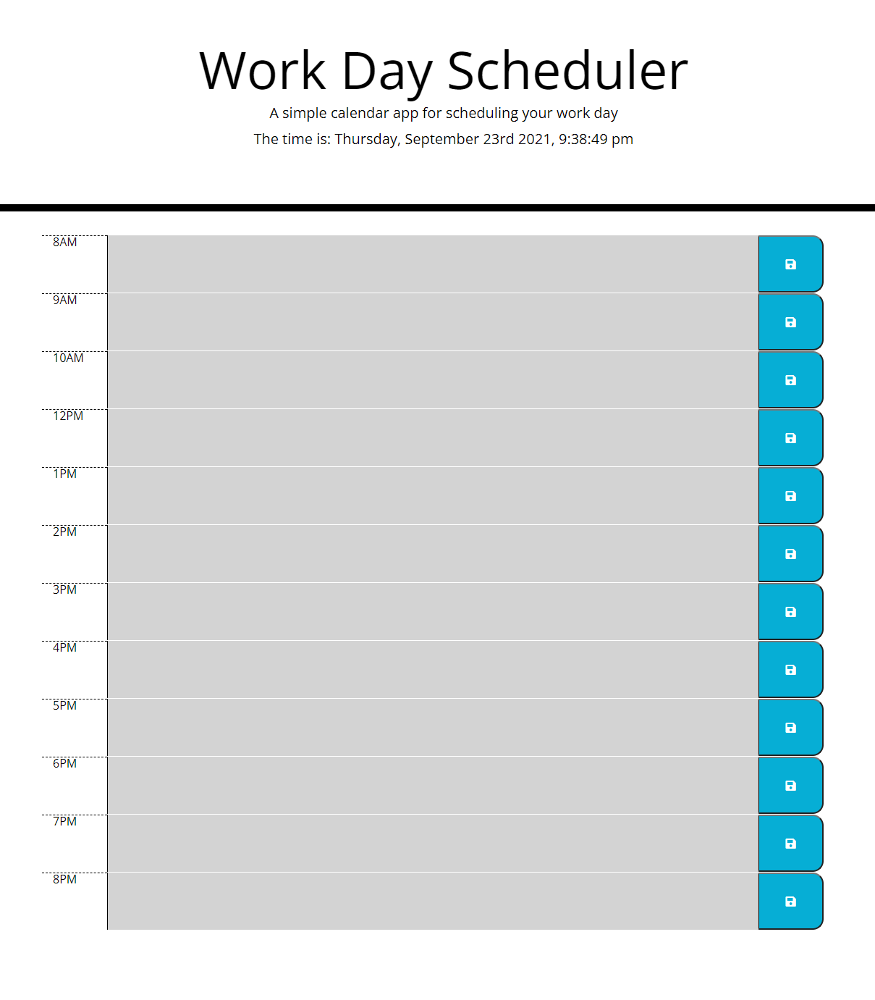

# Daily-Planner
Application for recording and tracking tasks. 

This application dynamically displays hour blocks of the user's schedule, styling the individual schedule blocks depending on if the hour has past, is passing, or is in the future. The user can type tasks or notes for themselves, and save them locally, so that they continue to display and can be edited and resaved. 

The application is deployed at: https://joshuakwatkins.github.io/Daily-Planner/

